Oracle Integration Cloud Lab2 - Creating a Decision Rule
========================================================

### Introduction 

This lab will teach you how to leverage a Decision rule in OIC Process, using
the new DMN-based engine.

This rules engine is independent of your application. This means that you can
alter the criteria of the rules and redeploy it without having to alter the
application(s) that use it.

In addition, the rule, despite the fact that it is designed with the "process"
space, can be used by any component, since it provides a REST interface.

The objectives of this lab is to:

1.  Teach you how to leverage a Decision Rule and deploy it.

2.  Use the *Travel Request* application created from the previous lab (or from
    a QuickStart template here)

3.  Modify the Travel Approval process so that it leverages your new rule: Use
    case definition

The steps you will accomplish in this lab are::

-   Study a rule that will make an automatic approval for travel requests to
    France or Germany IF the amount is less than 1000 € OR if there is at least
    2 weeks advance notice. In any other case, it will require a further
    management approval

-   Deploy that rule

-   Add a step to the process so that it checks with the newly deployed rule.

-   Send some traffic to test the rule

-   Change the rule on the fly and re-test.

-   Find out the Interface to that rule and re-use from another component such
    as Postman.

The actual decision criteria are as follows:

| *Country of Destination* | *Amount* | *Date of Travel* | *Outcome*     |
|--------------------------|----------|------------------|---------------|
| France or Germany        | \<=1000€ | \<=15 days       | Auto Approved |
| France or Germany        | \>1000€  | \>15 days        | Auto Approved |

### Step 1: Login to OIC

1.  Log in OIC with your credentials, or those given to you, in the work
    environment that has been assigned to you.

2.  Go to “Process” -\> "Process Applications"

3.  If you have already created a Travel Application in the previous lab, you can skip the rest 
of this section and go directly to *Step 2*.

In case you have not done the previous lab, you can easily create a new
application from a QuickStart template:

1.  Click *Create*

2.  From the Gallery of templates, choose *Travel Approval*

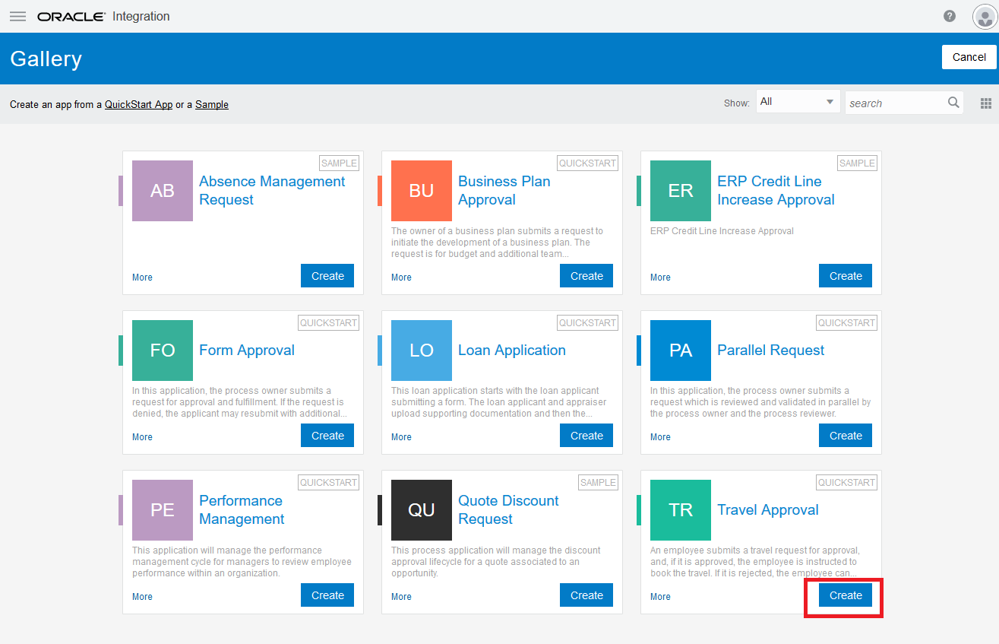

In case you are on a shared environment, name your application **xxTravelApp**,
where **xx** is your student number (in front so that it’s easier to spot after
deployment

### Step 2: Deploying the Decision Rule

**Importing a Decision Model**

1.  Download on your PC the pre-defined rule that you can find here: [link](./dependencies/TravelDecision.dmn)

2.  From *Process,* click *Decision Models*

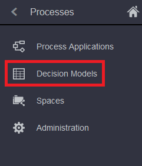

3.  Under the **Create** button, chose *Import a Decision Model*. Chose the TravelDecision.dmn file that you just downloaded.

2.  Give it a name that is preceded with your Student number to avoid
    confusion with other people’s work (in case you are on a shared environment), such as *XXTravelDecision*, 
    where *XX* are your initials.

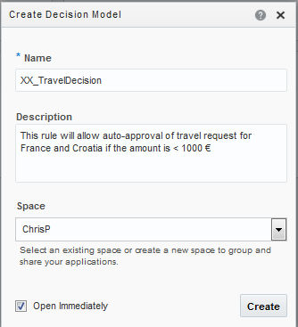

Click the **Import** button

### Step 3: Study this DMN rule:

Open the Decision model you just imported, and study it. The "days before Travel" expression allows us to calculate the number of days between 2 dates

1.  Click the white on blue “V” sign on the right of the Expression and look at *DaysbeforeTravel*

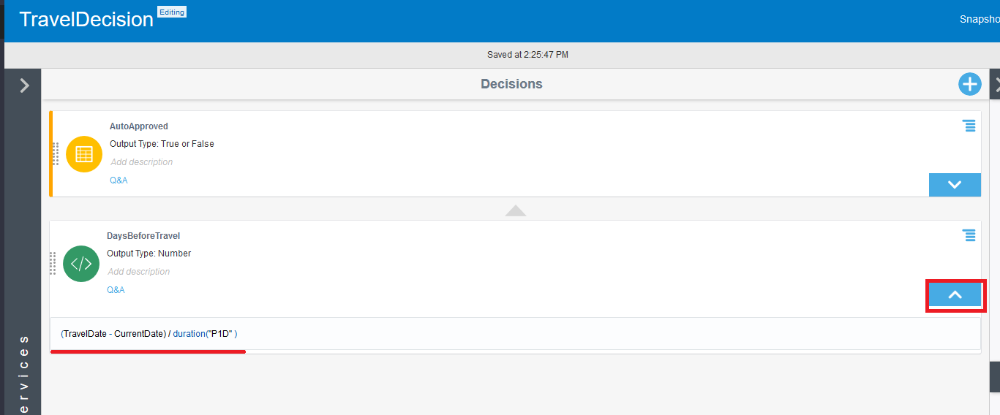

2.  See how the Expression is written: *(DateofTravel - CurrentDate) /
    duration("P1D" )*

Note: *P1D* means *“in 1 day unit”.* We are here calculating the number of days
between today and the travel date. Your expression should look like this:

**Study the Decision Table**

1.  Click the white on blue “V” sign to expand the *Auto Approval* Decision Table

2.  See how it is designed, in order to meet the following decision rules:

| *Country of Destination* | *Amount* | *Date of Travel* | *Outcome*     |
|--------------------------|----------|------------------|---------------|
| France or Germany        | \<=1000€ | \<=15 days       | Auto Approved |
| France or Germany        | \>1000€  | \>15 days        | Auto Approved |

**Study the Service Interface**

In order to make this rule callable from "the outside" , a Service Interface had
to be created. Study how it is defined by expanding the left section, then

1.  Expand the section on the left by clicking the expand sign next to the “+”
    sign on the left, in the **Services** pane.

2.  Expand the *TravelDecisions* Service

3.  You can study the four input fields that will be required in order for the
    rule to be evaluated

4.  Look at how the **Output Decisions** field was added as the field that will
    be returned by this rule

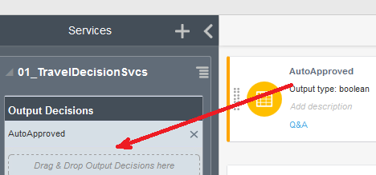

5.  At the end, the service definition looks like this:

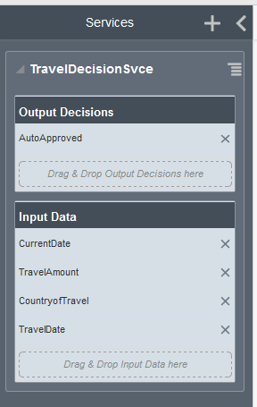

### Step 4: Testing the Decision

1.  Click the blue “Run” triangle on the top right

2.  Enter values for all the required field:

    1.  Dates should be entered in the form **“2019-11-29”** for November 29th,
        2019 (*with* the double quotes). Enter a date interval of more than 15
        days

    2.  Enter an amount of 500€

    3.  Enter “France” as a country:

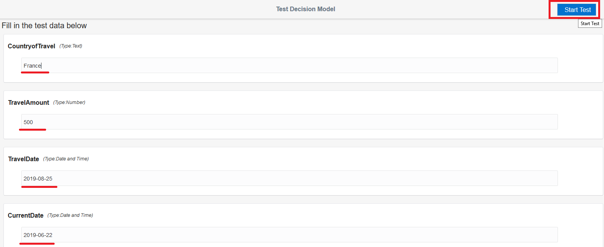

3.  Click the **Start Test** button. You should see the result of the decision
    evaluation appearing, set to **True**.

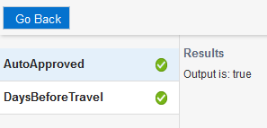

4.  Put an amount of 1200€, and change the date interval to be less than 15
    days, and then test again. Your decision should now evaluate to **False**
    despite the fact that the country is France.

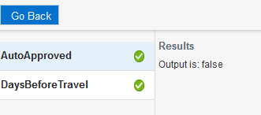

You can test the other combinations if you want to.

### Step 5: Activate the Rule

1.  Click the blue **Activate** button on the top right

2.  Click the **Activate** button from the snapshot screen. If you have
    previously deployed this same decision model, you will need to check the
    **Overwrite** box.

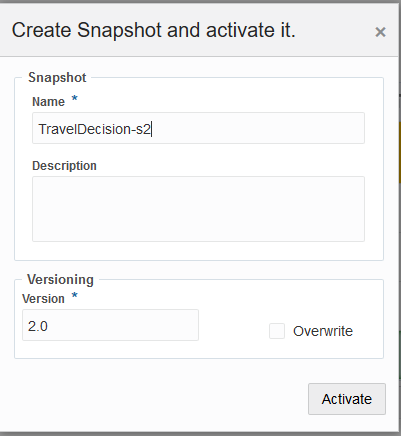

Your Decision model is now deployed

**KEY LEARNING POINT: You can create expressions and decision matrices that will
allow the implementation of decision rules, based on valued passed to the
engine, as well as calculated expression. This engine will run as standalone and
will be invoked via a REST call, whose interface you have defined. Now, you need
to modify your application so that your process can invoke the engine.**

**Using the Decision Model in your application**

If you have leveraged your application from the previous lab, you are already
all set, and you can skip this section and go to *add the Decision Model* to
your Application

On the contrary, if you have created your *TravelApplication* form a quickstart
in this lab, you will need to add the *Country of Destination* as explained
below

### Step 6: Adapting the Form to add a country of destination.

The Default Entry form of the Quickstart-generated travel application does not have a field named
"country of Destination". We will need this in order to be able to test our rule.
**If you have done the previous lab, you can skip this and go to step 7**

1.  From the **Process** pane, click **Process Applications** and open your
    Travel Application. Since it is a Quickstart application, you will need to
    click the *switch to Application view* link on the top right.

2.  Click **Forms** icon on the left black pane

3.  Open the *TravelRequestform*

4.  Drag and drop a field of type *InputText.*

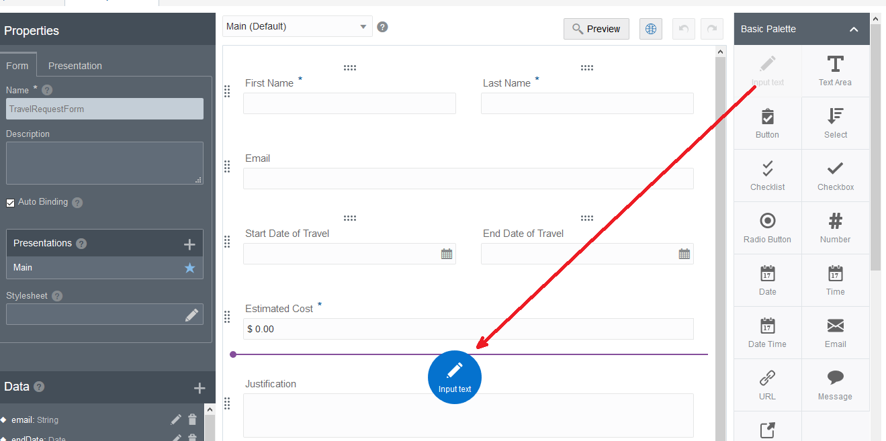

5.  Rename the field *countryOfDestination*, and the label "Country of
    Destination".

6.  in the default values for the field *countryOfDestination*, add 3 countries:
    - France
    - Germany
    - Croatia
    
   It should look like this:

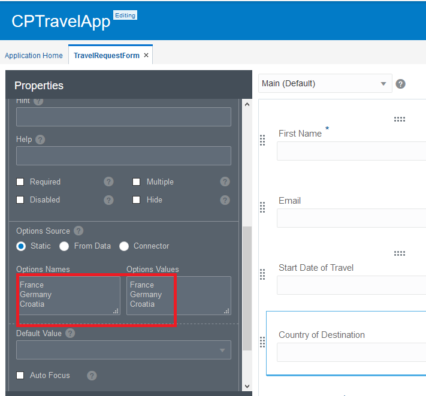

Save your work

### Step 7: Add the decision model to your application.

The rule that you have imported is not yet known to your application. In order
to be able to leverage this rule, it needs to be pointed at.

1.  Open your Travel application

2.  Click on Decisions, on the black left pane.

3.  Click the Create blue button on the right, then click the blue button "link
    to a decision model:

4.  Choose your decision model , and click **Use**

This rule is now known to your application, and can be leveraged.

### Step 8: Modify your process to add the Decision Model.

1.  From the **Process** pane, click **Process Applications** and open your
    Travel Application. Since it is a Quickstart application, you will need to
    click the *switch to Application view* link on the top right.

2.  Click on the **Travel Approval** process

3.  Add the deployed Decision Model

    1.  From the right pane, drag-and-drop a Decision task onto the canvas at this position:

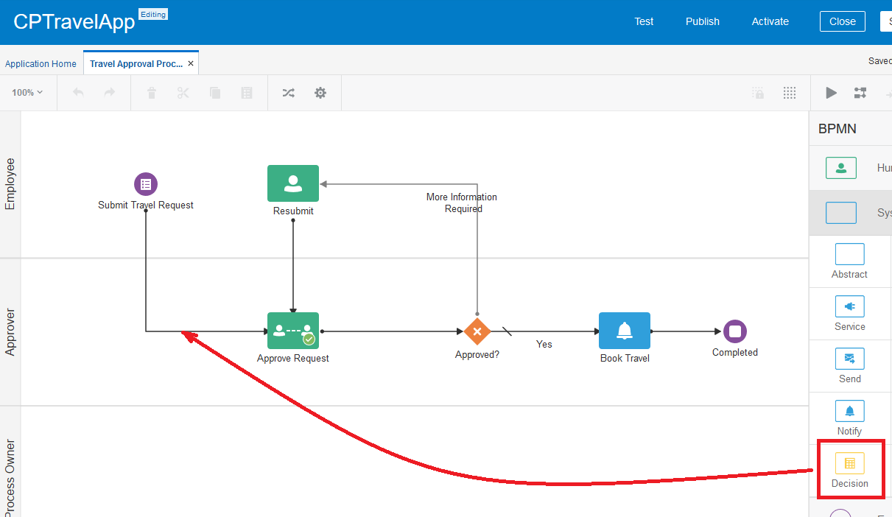

4.  Change the title of Decision model to *AutoApprove Decision*.

5.  Add a Gateway to fork between auto approve and management approval

    1.  Drag and drop from the right pane an Exclusive Gateway

    2.  Add the proper connectors so that your initial start task flows to the
        decision task, then to the Gateway

    3.  From the gateway, the *unconditional branch* goes to the **Management
        Approval** task, while the *conditional branch* goes to **Book Travel**.
        Your process might look like this:

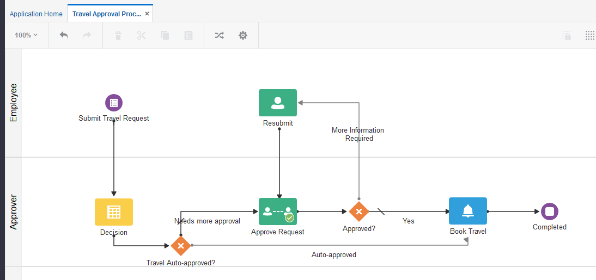

6.  Implement the Decision Model

    1.  Highlight the Decision task, and open the **Properties**.

    2.  Click the blue “+” sign to add a Decision Model

    3.  Select your Decision Model, and click **Use**.

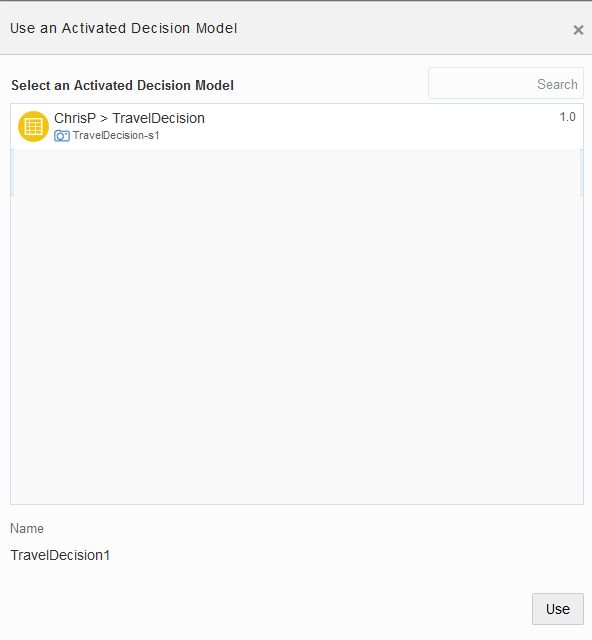

7.  Modify the Data Association

    1.  Highlight the Decision task, and open the **Data Association**.

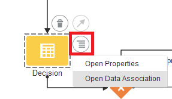

8.  Map the fields from the **newWebForm** with the four required field of the AutoApproved Decision.

9.  **NOTE**: Map **CurrentDate** to the value *‘now’* (with single quotes).

10.  Your mapping should look like this:

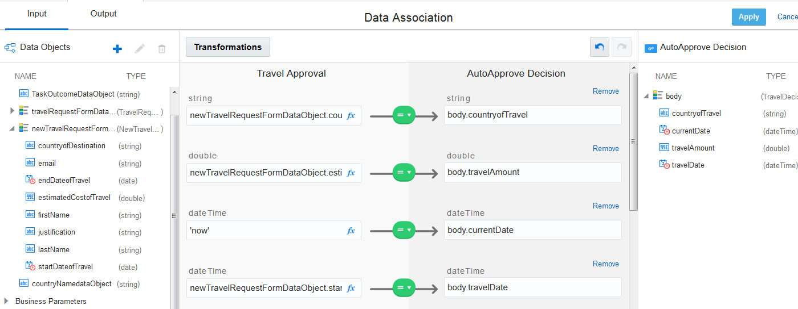

11.  Map the Output field Data Association

    1.  Click the **Output** tab on the top left, and add a new Data object by
        clicking the blue “**+**” on the right.

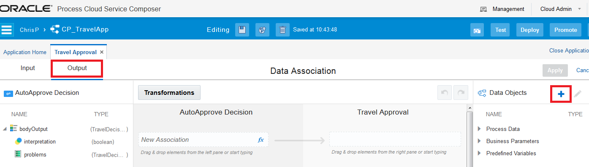

12.  Add a new **Data object** of type *Boolean*, name it
    *autoApprovedDataObject*. (NOTE: the name has to start with a lowercase
    letter).

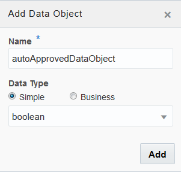

13.  Map the output of the Decision Model task (the **Interpretation** field) to
    this newly created DataObject:

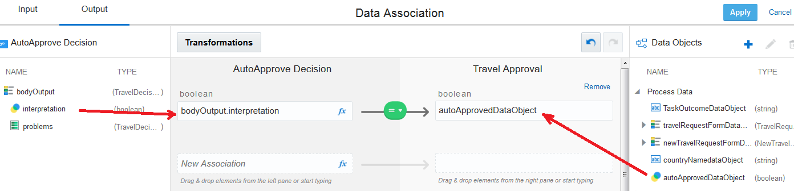

14.  Click the **Apply** button.

15.  Add the Gateway condition:

    1.  Select the gateway branch that goes to Book travel, and edit it.

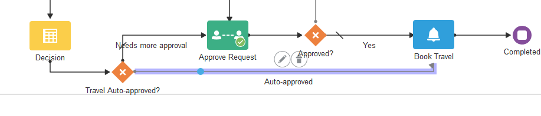

16.  Edit the condition for the gateway by clicking the pencil on the right.

17.  Highlight the **autoApprovedDataObject** and click **Insert into
    Expression**

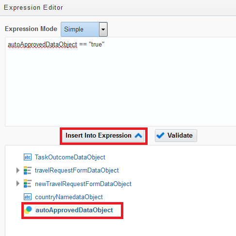

18.  Add **== “true”** then click the **OK** button at the bottom.

19.  Validate the expression

20.  Save your work

**Reactivate your Travel Application**

Activate the application like you normally do (remember to Publish first). If
you need help on the activation process, see other basic labs for more
explanations.

### Step 9:Testing your application

You should be somewhat familiar with this section since it is similar at what
you have done in the previous lab.

1.  Click the Test button on the right of the blue band (as you did in Lab 1)

    1.  Click the *Activate* button on the top right

    2.  Click the *Test in Workspace* button

    3.  Click the icon to launch you application

    4.  Enter any names and email.

    5.  Enter a **Travel amount** of *1200€*

    6.  Enter **a travel start date** that is *less than 15 days* later than
        today

    7.  Choose any country except *France* or *Germany*.

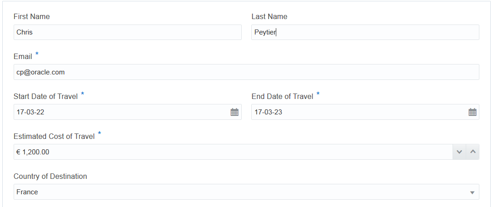

As a result, your Travel request should **not** be auto approved, and need
management approval. You should thus see a task waiting for you in your task
list, like with the standard, travel application done in Lab 1.

2.  Do a second test by entering the same values on your form, except the dates
    and the country. This time choose *a* **departure date** at more than 15
    days from today and a country like *Germany* or *France*

Now, your Travel request should be auto approved, because trips for this country
and with more than 15 days notice are auto-approved, regardless of the amount.

You can verify that by the fact that you should NOT have a management task
waiting for your approval…

**KEY LEARNING POINT: We have applied a DMN rule to alter the flow of a BPMN
process. We can see that depending on the criteria we enter, the rule will allow
automatic approval if the conditions are met.**

### BONUS: Step 10: Changing the decision criteria.

If you have time, we are now going to relax a bit the Travel criteria. Instead of a threshold of
1000€ for auto approval, we will raise this bar to 1500€. As a result, your
previous 1200€ travel request to France should now be auto approved without
management review.

1.  Open your Decision Model

    1.  Open the **AutoApproved** decision

    2.  Change the rules that were indicating Travel Amounts of 1000€ and set
        these values to *1500*€

    3.  Save your work

2.  Re-Activate your decision model. Keep the same version 1.0, and check the
    overwrite box:

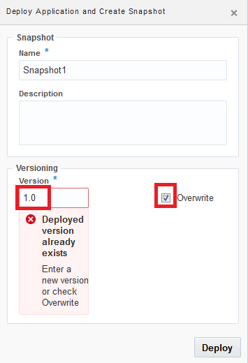

3.  Return to OIC Home and run again your application

Enter exactly the same values as for your last test that was NOT auto-approved:

Enter a **Travel amount** of *1200€*

Enter **a travel start date** that is *less than 15 days* later than today

Chose *France* as the **Country**.

4.  Check again your Task list. This time, you should NOT have a task waiting,
    because with the new, more relaxed, criteria, your 1200€ now got
    auto-approved.

-   **KEY LEARNING POINT: With this new DMN Decision Modeling engine, criteria
    can span across several applications. Moreover, they can be altered without
    requiring redeployment of any application.**

**Congratulations**! You have successfully completed this lab.

For questions or feedback, please contact [Chris
Peytier](mailto:christophe.claude.peytier@oracle.com) Oracle EMEA Cloud Pursuit
Group
